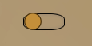

<h1 align="center"> Calculos básicos.</h1>

> Exercício turma Explorer/Rocketseat🚀

> A ideia principal dessa página é de fazer calculos básico a partir de dois números que for fornecido pelo o usuário. Mais detalhes na página inicial do projeto.

> Página responsiva e com dois temas funcional a partir de um botão.🔘

 
> Multiplas janelas:
- Janela inicial
- janela de operação
- janela de resultado

[😊⭐⭐Clique aqui para acessar⭐⭐😊](https://romeusorionaet.github.io/OperandoNumeros/)

## Tecnologias utilizadas

- HTML
- CSS
- JavaScript

## Vamos nos conectar!
- [linkdin⭐](https://www.linkedin.com/in/romeu-soares-87749a231/)

- [Instagram⭐](http://instagram.com/romeusoaresdesouto)
